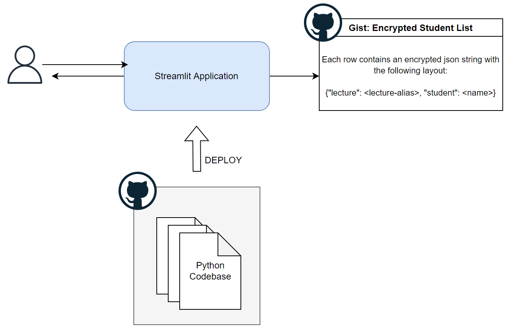

# Students - Random Choice

This is a simple streamlit application that facilitate selecting random student names.

Design constrains:
* Open source solution & codebase.
* Allow secure manipulation of the student info.
* Easy to configure and shareable.



## Local setup

Create and activate a python virtualenv. Install dependencies:

```commandline
$ pip install -r requirements.txt
```

Create a `.env` file using the `.env.example` template:

```commandline
$ cp .env.example .env
```

Run the streamlit application:

```commandline
$ streamlit run app.py
```
